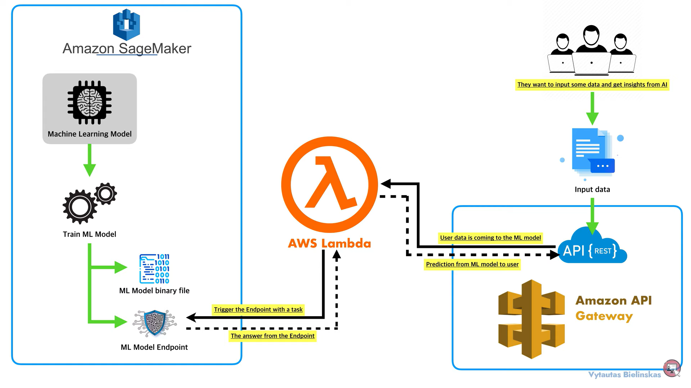
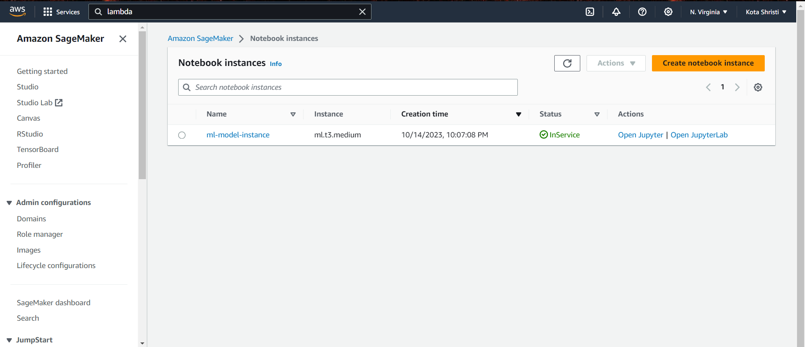
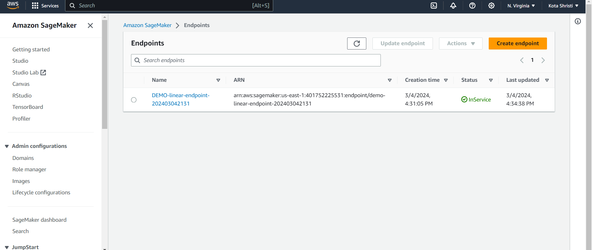
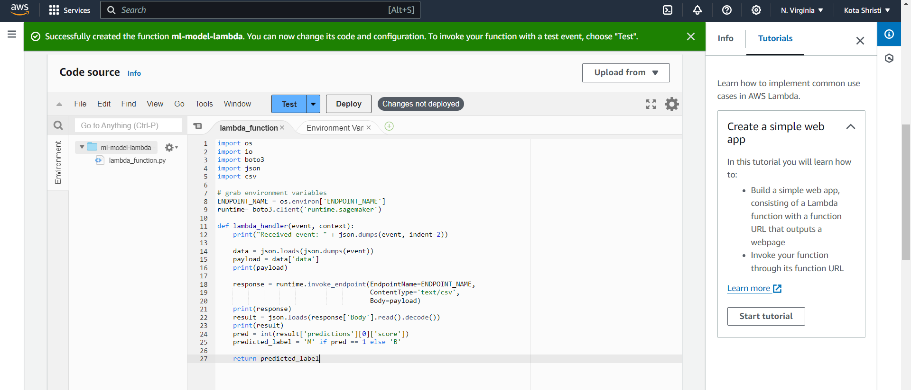
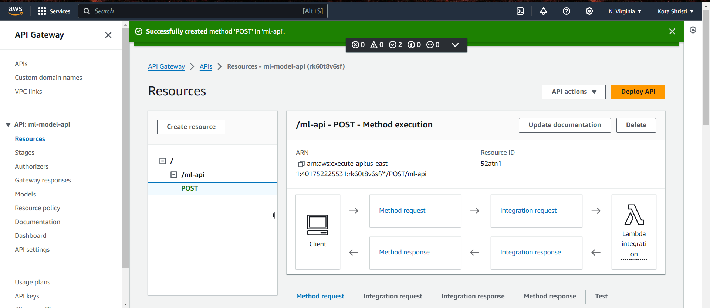
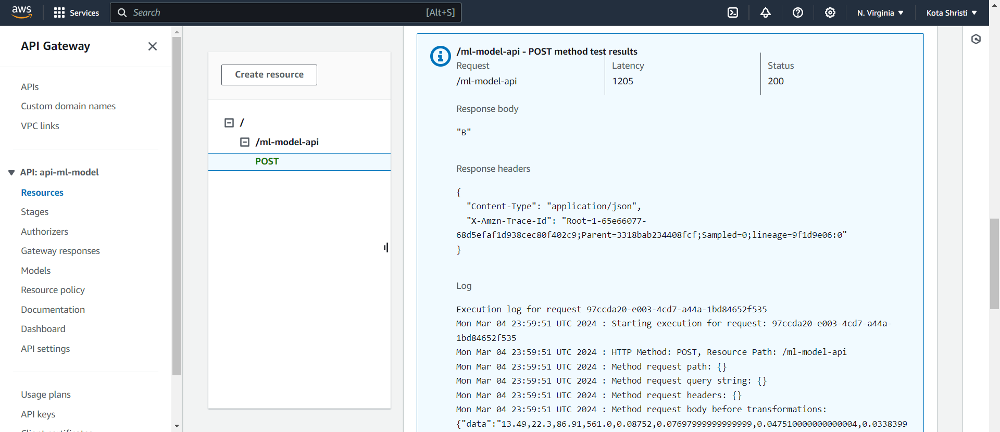

## Integration-of-AWS-Sage-Maker-AWS-Lambda-and-REST-API-for-Breast-Cancer-Prediction

This project aims to predict breast cancer using a machine learning model hosted on Amazon SageMaker, with AWS Lambda to trigger the model and Amazon API Gateway to provide a RESTful interface.

## Introduction

<table>
  <tr>
    <td>
      
    </td>
  </tr>
</table>

The model is developed and trained using Amazon SageMaker, which also hosts the machine learning model endpoint. AWS Lambda function is used to trigger this endpoint, allowing for scalable, on-demand processing of inference requests. User input data is sent to the model via the Amazon API Gateway, which provides a RESTful API endpoint, ensuring secure and managed access. This gateway decouples the user interface from the backend processing, facilitating the model to receive data and send back predictions. The architecture embodies a serverless, highly scalable approach to deploying machine learning models in production.

## Process

The following steps summarize the workflow of the breast cancer prediction model using AWS services:

 **SageMaker Notebook Instance Creation**
   - An Amazon SageMaker notebook instance is created, providing an environment to preprocess data, develop, and train the machine learning model.

<table>
  <tr>
    <td>
      
    </td>
  </tr>
</table>

**Data Preparation**
   - A breast cancer dataset is downloaded from the UCI repository.
   - Data preprocessing is performed to appropriately name columns and prepare the dataset for the model.
   - The dataset is split into training, validation, and test subsets.

**Model Training with Amazon SageMaker**
   - A linear learner model is trained on the processed dataset within SageMaker, with data artifacts stored in an Amazon S3 bucket.

**Model Deployment**
   - The trained model is deployed to a SageMaker endpoint, which enables it to serve real-time predictions.

<table>
  <tr>
    <td>
      
    </td>
  </tr>
</table>

 **AWS Lambda Function Configuration**
   - An AWS Lambda function is set up to invoke the SageMaker model endpoint. This function acts as a bridge between the SageMaker endpoint and the REST API, handling incoming prediction requests. Below is the code source for lambda function 

<table>
  <tr>
    <td>
      
    </td>
  </tr>
</table>

**REST API via Amazon API Gateway**
   - Amazon API Gateway is configured to create a RESTful API endpoint. This endpoint is integrated with the Lambda function, allowing users to send input data for predictions securely.

<table>
  <tr>
    <td>
      
    </td>
  </tr>
</table>

**Prediction Invocation**
   - Users interact with the REST API to send input data, which triggers the Lambda function. The function then calls the SageMaker endpoint to obtain predictions and sends the results back via the API Gateway.

   ## API Gateway Request and Response

The screenshots demonstrate the interaction with the breast cancer prediction model via the AWS API Gateway. A JSON-formatted request body containing the input data for prediction is submitted to the REST API endpoint `/ml-model-api`. This endpoint is configured to invoke an AWS Lambda function, which processes the input and interacts with the deployed SageMaker model endpoint.

The Lambda function successfully triggers the model, which processes the input data and returns a prediction. In this case, the model predicts "B", indicating a benign outcome. The API Gateway then relays this response back to the client. The response is accompanied by standard HTTP response headers, which include content type and trace ID for debugging purposes.

This streamlined process exemplifies how AWS services can be orchestrated to deploy a machine learning model that is both scalable and easily accessible via HTTP endpoints, abstracting the underlying complexity of the end user.

<table>
  <tr>
    <td>
      
    </td>
  </tr>
</table>

<table>
  <tr>
    <td>
      
    </td>
  </tr>
</table>

**Cleanup and Resource Management**
   - To optimize costs and resource usage, the SageMaker endpoint is deleted after its use.
